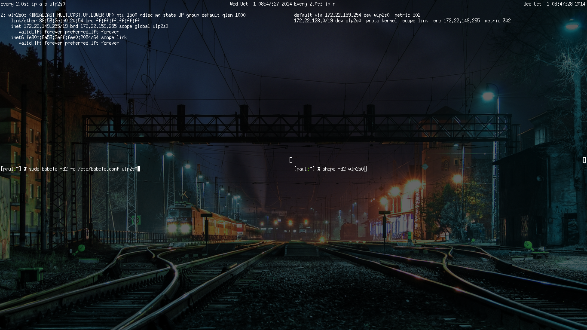

# Réseaux meshés avec `babeld`

> Auteur  : Paul Ollivier <contact@paulollivier.fr>  
> Date    : 2014-09-29  
> Version : 0.1  


!!! attention
    Ce document est en version alpha. Ce n'est qu'un guide destiné à la
    découverte de `babeld`. Certains comportements peuvent être imprévisibles,
    notement liés aux spécificités des packages propres à la distribution
    utilisée, aux versions de `babeld`.

    Il est donc important de prendre ces informations pour ce qu'elles sont: un
    guide non-exhaustif. Il est laissé à la discrétion du lecteur de détecter et
    corriger lors de ses propres exprériences les comportements non-détaillés
    dans ce document.

    De plus, si des corrections ou compléments sont ajoutés, vous êtes invités à
    m'en faire un retour par mail (addresse indiquée au début du présent
    document), de tels apports seront fortement appréciés.

## Introduction

[Babel][1] est un protocol de routage destiné principalement aux réseaux sans
fil en mode ad-hoc.


Les réseaux meshés posent plusieurs problèmes pour déterminer comment contacter
la machine cible. Si `A` veut contacter `E`, par quel chemin passer? Une
solution serait de rentrer les routes à la main, sur chaque station. Ce n'est
pas viable sur le long terme, et impacte sévèrement la mobilité des stations.

Afin d'obtenir un réseau dont la topologie puisse changer, nous avons
obligatoirement besoin d'une couche d'automatisation, afin de pouvoir réagir
assez rapidement. Babel a donc pour but de permettre un partage de route entre
différentes stations, qu'elles soient sans fils ou câblées. Ainsi, les tables de
routages de chaque station sont tenues à jour, avec une métrique adaptée au coût
de la liaison.

Babel est un protocole de routage pro actif à vecteur de distance, comme OSLR,
mais avec des capacités réactives, comme AODV (Il va trouver une route inconnue
très rapidement, même si non optimale. Elle sera optimisée par la suite). Il est
également conçu pour fonctionner aussi bien sur IPv4 que IPv6.

## Mise en place d'un réseau sous `babeld`

### Outils et matériels

`babeld` est l'implémentation la plus répandue du protocole Babel. Elle a été
portée sur la majorité des systèmes GNU/Linux et BSD. Il existe des paquets
Debian, des paquets RedHat, et des paquets (légèrement modifiés) existent même
pour OpenWRT. Bien que ces paquets fournissent des scripts d'init afin de
tourner en tant que service, nous avons préféré lancer directement les
exécutables `babeld` et `ahcpd` avec le paramètre `-d2`, pour afficher plus
d'informations à l'écran.

Il semble logique dans le cadre de la mise en place d'un réseau sans fils ad-hoc
d'avoir besoin d'interface sans fils. De plus, nous allons utiliser un minimum
de trois machines, dont une disposant d'une connexion internet, sous la
distribution GNU/Linux Debian.

La machine `A` disposera de deux interfaces dont une connectée à internet,
l'autre étant utilisée pour le réseau ad-hoc. Les deux autres machines n'ont
besoin que d'une interface.

Voici un schéma représentant ce réseau:


Babel s'occupe de la partie routage, mais pas de la partie adressage IP des
stations. Pour ce faire, un protocole compagnon a été développé (avec son
implémentation), AHCP. AHCP fonctionne plus ou moins comme DHCP, mais adapté aux
réseaux ad-hoc. Les différents clients et serveur AHCP vont donc propager les
requêtes d'adresses IP, afin d'assurer une distribution dans tout le réseau.

### Configuration des interfaces

Nous allons configurer de manière temporaire les stations. Pour cela, nous
allons utiliser `ifconfig` et `iwconfig`. Dans un premier temps, nous
utiliserons une configuration IP manuelle.  <!-- TODO: réécrire ça avec iw et ip
-->


Pour commencer, nous allons configurer les interfaces participant au mesh sur
les stations `A`, `B` et `C`:

```sh
ifconfig wlan0 down
iwconfig wlan0 mode ad-hoc essid babel-mesh
iwconfig wlan0 channel 1 ap ca:fe:ca:fe:ca:fe
iwconfig wlan0 rts 512
```

Remarquons l'usage d'`ap ca:fe:ca:fe:ca:fe` afin de définir la cellule que nous
souhaitons rejoindre. Cela permet de s'assurer aisément que deux stations soient
bien dans la même cellule.

Après avoir vérifié que les trois interfaces se situent dans la même cellule,
nous allons pouvoir configurer les addresses IP. La commande `ifconfig` permet
de donner une addresse à une interface, avec la syntaxe suivante: `ifconfig
wlan0 <ip>/<masque>`.

- `A`: `192.168.0.129/25`
- `B`: `192.168.0.130/25`
- `C`: `192.168.0.131/25`

Enfin, nous allons pouvoir rallumer les interfaces: `ifconfig wlan0 up`

À ce stade, nous allons pouvoir lancer babel et observer les tables de routage
se remplir. Pour ce faire, il est intéressant d'utiliser un multiplexeur de
terminal, comme [`tmux`][2] ou [`screen`][3]. Notons que la commande `watch -d`
permet de surligner les différences entre deux exécutions de la commande passée
en paramètre. Il est ainsi recommandé de surveiller au moins la commande `ip r`,
qui affiche les routes, ainsi que leurs états. `ip a s wlan0` affiche des
détails sur l'interface, il peut être intéressant de la surveiller aussi.
En voici un exemple (note: ici, `wlp2s0` désigne mon interface wifi principale): 


### Lancement de `babeld`

#### Prérequis

Il faut disposer d'une version de `babeld` >= 1.5.0. Il est recommandé d'utiliser les
packages Debian (version *jessie* recommandée).

#### Configuration

Nous allons écrire un fichier de configuration, `/etc/babeld.conf`:

    interface wlan0  # We want babeld to listen on this interface.
                     # Put a new interface directive for each interface 
                     # needed.
    redistribute proto 3 ip 0.0.0.0/0 metric 128  # We arbitrarly choose a
                                                  # metric for the default
                                                  # route

Pour ceci, nous allons executer dans une des fenêtres disponibles la commande
suivante:

    sudo babeld -d2 -c /etc/babeld.conf wlp2s0

Pour commencer, nous avons besoin d'être en root afin de laisser à babeld le pouvoir
de modifier les tables de routage. Nous lançons babeld avec le paramètre `-d2`
pour bénéficier de messages de logs bien plus verbeux que son mode d'exécution
habituel. Enfin, nous lui indiquons via l'option `-c` le fichier de
configuration à utiliser.

Pour la machine `A`, connectée à internet, vérifier la présence d'une route par
défaut via la commande `ip r`.

!!! note
    Il est important de noter qu'un usage de babeld en mode daemon, via par
    exemple les initscripts SysVInit peu donner lieu à une configuration plus
    spécifique. Par exemple, l'interface se définira plutôt via variable
    d'environnement passée par le script `/etc/init.d/babeld`, qui se charge lui
    d'invoquer `babeld`.

Répéter cette opération sur les autres machines. Si tout se passe bien, la table
de routage de chacune de ces machines devrait se remplir, Avec les adresses des
autres machines présentes dans le réseau, et avec la route par défaut.

Il peut être intéressant à ce stade de se déplacer physiquement avec les
machines, changeant la topologie du réseau, afin de voir les changements dans
les tables de routage. Les temps de convergence du réseau sont également très
intéressant à observer ( < 1 minute).

## Ajout d'une gestion de protocole DHCP via `ahcp`

### `AHCP`: le DHCP pour les réseau meshés ad-hoc

Le DHCP est utilisé dans les réseaux en étoile pour attribuer des adresses IP
automatiquement en fonction des adresses disponibles. Il repose sur un message
envoyé en broadcast sur le réseau par la machine cliente, auquel répondra un
serveur DHCP, entamant la négociation du bail d'adresse.

Ce mécanisme est plus compliqué dans le cadre d'un réseau meshé, de part
l'absence de mécanisme de broadcast au niveau du lien simple.

C'est pour ça que le créateur de babel, [Juliusz Chroboczek][4], a créé le
protocole AHCP, et une implémentation de référence, `ahcpd`.

### Installation et configuration d'`ahcpd`

Installer ahcpd via votre méthode favorite. Nous allons écrire un fichier de
configuration:

``` sh
mode server
lease-dir /var/lib/ahcpd-leases/
prefix 192.168.0.128/25
name-server 8.8.8.8  # here, we use google DNS. Do not do that in a real setup
ntp-server 129.250.35.251 # a NTP server running on the bridge would be
                          # preferable

```

Le fichier est assez simple à comprendre. Notons toutefois que les droits
d'accès au répertoire spécifié par `lease-dir` doivent permettre à l'utilisateur
lançant ahcpd d'y accéder en lecture et écriture.

Il est également important de noter la présence d'une annonce de serveur NTP. Il
est très important pour la redistribution des routes que toutes les machines
concernées aient la même horloge, pour des raisons évidentes de mise à jour de
routes.

Une fois lancé, il est intéressant d'observer les messages échangés, par exemple
via wireshark.

<!-- footer -->
## Aller plus loin

Babel est capable d'utiliser deux interfaces pour communiquer avec d'autres
stations en duplex. Il peut être intéressant d'étudier cet aspect.

De plus, une interface web (babelweb) est disponible, tournant sous node.js, qui
propose une visualisation de l'état du réseau, et ce que connait du réseau la
machine faisant tourner l'interface.


[1]: http://www.pps.univ-paris-diderot.fr/~jch/software/babel/
[2]: http://tmux.sourceforge.net/
[3]: http://www.gnu.org/software/screen/
[4]: http://www.pps.univ-paris-diderot.fr/~jch/

<!--  vim: tw=80:ts=4:spell:spelllang=fr,en
-->
